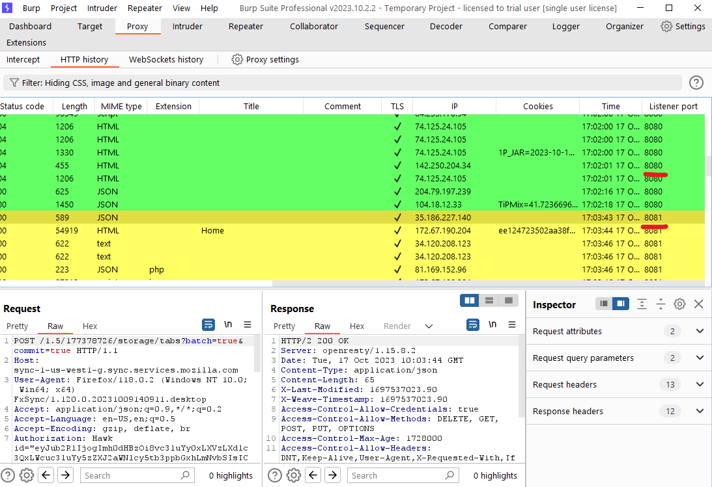

# burp-highlight
 BurpSuite Montoya extension to highlight traffice based on Proxy Listener port. Currently support:
 - GREEN Highlight for traffic sent to port 8080
 - YELLO Highlight for traffic sent to port 8081
 
Download at release page [HERE](https://github.com/catmandx/burp-highlight/releases) 
